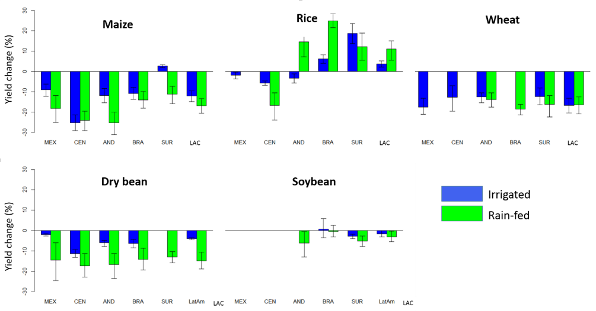

--- &vcenter
## Introducción


> *  Representa aproximadamente el 5% del producto interno bruto de la región (PIB) en 2012 (Vergara et al. 2014).

> * Aproximadamente el 20% del total del empleo (Banco Mundial, 2014). 

> * (Alexandratos y Bruinsma, 2012; Zabel et al. 2014). Se espera que América Latina ayude a garantizar la seguridad alimentaria mundial en las próximas décadas debido a las grandes extensiones de tierras de cultivo y las condiciones ideales de crecimiento en muchas áreas. 


--- &vcenter
## Introducción

> - Muchos estudios de modelación han llevado a cabo específicamente para evaluar los impactos potenciales del cambio climático en la producción de cultivos, muchos de los cuales están incluidos en el Grupo Intergubernamental de Expertos sobre las evaluaciones de Cambio Climático (IPCC) (White et al 2011;. Magrin et al 2014;. Porter et al. 2014). 

> - Existen los Modelos de cultivos basados en procesos pueden ayudar a estimar el efecto neto de los cambios climáticos sobre rendimientos de los cultivos, mientras que los modelos basados en nichos de estimar los cambios en la idoneidad en condiciones climáticas futuras (Estes et al. 2013).


--- &vcenter
## Introducción

> - El cambio climático podría afectar la producción de cultivos a través de muchos mecanismos diferentes (ver Hatfield et al. 2011, Lobell and Gourdji, 2012, Porter et al. 2014 para una revisión).

> - Cortas duraciones del ciclo de crecimiento de los cultivos, el aumento de estrés por calor durante la floración (Teixeira et al 2013; Lobell et al. 2013; Asseng et al. 2014) (Eyshi et al, 2014).

> - Aumento del estrés hídrico debido a la disminución de precipitaciones y de mayor intensidad, además de mayor evapotranspiración (Alexander et al 2006; Sheffield y Wood, 2008; Dai 2013; Cook et al. 2014).

> - Efecto de fertilización por CO2 (Ainsworth and Long 2005; Long et al 2006; Leakey et al. 2009).
 

--- &vcenter
## Objetivo 

> - Este estudio tiene como objetivo contribuir a una mejor comprensión de los efectos del cambio climático a corto plazo (hasta la década de 2030) sobre el rendimiento de los principales cultivos en la región de América Latina y el Caribe a través del uso de tanto los modelos de cultivos basados en procesos como los modelos de nicho. 

--- &vcenter
## Como se eligieron los cultivos a modelar?


(Fuente: FAOSTAT).


--- &vcenter
## DSSAT

> - Se utilizó DSSAT (Jones et al. 2013), para simular los cambios sobre el rendimiento para 5 cultivos previamente identificados como de alta prioridad para la región.

> - 


--- &vcenter
## Estrategia e insumos de modelación 

> - Período histórico (1971 a 2000) y un período futuro (2021-2049)
> - The Watch Forcing Dataset (WFD, Weedon et al. 2011) 
> - Presencia del cultivo (SPAM) 2005 v2.0 (You et al. 2014)
> - Áreas con sistema de riego MIRCA 2000 (Portman et al. 2010)
> - Global Gridded Crop Model Inter-comparison  (GGCMI;. Elliott et al 2014)
> - Información del suelo se extrajo para cada píxel de la base de datos del suelo Armonizado Mundial (HWSD;. FAO et al, 2012) 

--- &vcenter
## Resultados

> - 

--- &vcenter
## Resultados

> - 

--- &vcenter
## Resultados

> - 


--- &vcenter
## Resultados

> - 


--- &vcenter
## Resultados

> - 


--- &vcenter
## Preparación de la información

> * Make Soil Files
> * Sort Climate Data
> * Make Plantig Dates
> * Irrigation Areas
> * Fertilizer areas

Currently available script for these inputs spatially


--- &vcenter
## Códigos de R para DSSAT

Currently the code requires 6 files needed for runs DSSAT

> * main_functions.R    
> * make_xfile.R       
> * make_wth.R
> * make_soil.R
> * dssat_batch.R
> * DSSAT_run.R


--- 

### Run DSSAT in Parallel


```r
## libraries to work in parallel
library(foreach)
library(doMC)

##  Cpu in your computer
registerDoMC(15)

Run <- foreach(i = 1:dim(crop_riego)[1]) %dopar% {
  
  run_dssat(input_data, i, dir_dssat, dir_base)
  
}
```

